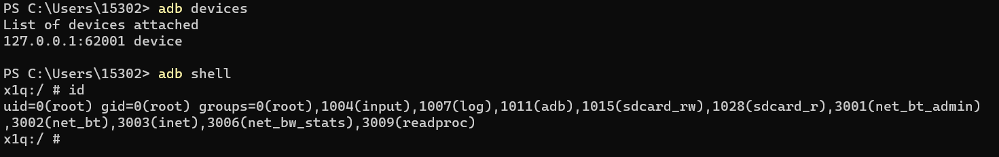
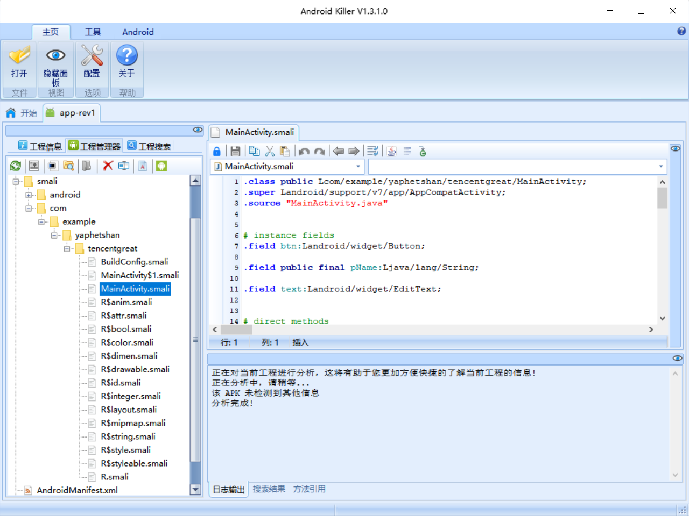
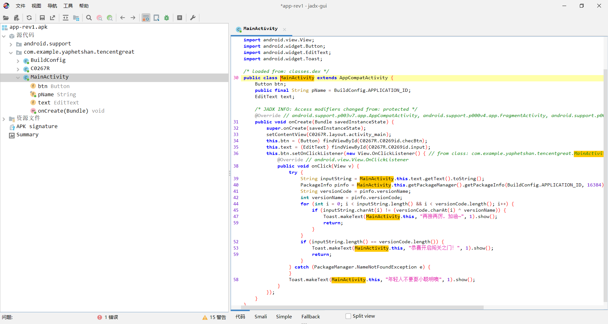

# 环境搭建

## 安卓模拟器

安装安卓模拟器是为了在电脑上模拟一个手机设备运行apk。如果直接使用手机，还需要对设备进行root或者安装别的框架，存在一定风险。所以这里选择使用模拟器。

可选夜神模拟器、雷电模拟器、mumu模拟器。这里以夜神模拟器为例。

https://www.yeshen.com/

点击“立即下载”，选择电脑对应的版本即可。

### 使用abd连接模拟器

安装完模拟器，你需要学会如何使用adb(Android debugging bridge)连接模拟器，获取模拟器的一个shell。

这一部分可以参考夜神[模拟器官网](https://www.yeshen.com/faqs/H15tDZ6YW)

出现如下内容，说明你安装成功了

## 反编译工具

本次课程需要反编译工具jadx，AndroidKiller。

下载链接：https://pan.baidu.com/s/1L_L8KfeLP46VtK1b9T3vlA?pwd=k2wi 
提取码：k2wi

你需要验证两种工具均能成功打开app-rev1.apk。

### android killer

### JADX

### IDA pro

下载链接：https://www.52pojie.cn/thread-1584115-1-1.html

按照注意事项安装即可。能够正常打开说明安装成功。

### apktool

选择以下最新版本下载，并添加到环境变量。

https://ibotpeaches.github.io/Apktool/

命令行输入apktool回车显示以下即为成功

